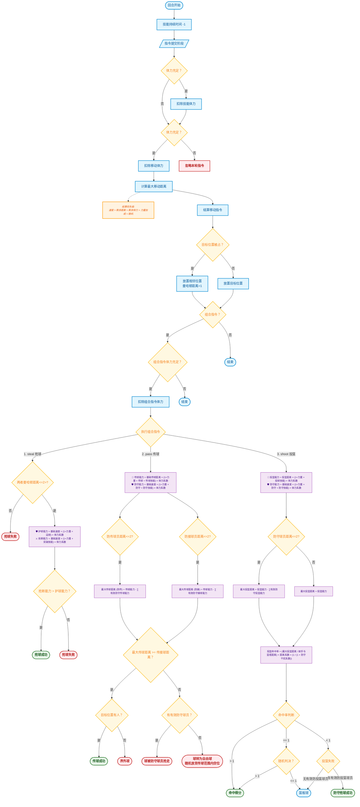

# 灌篮高手 - 竞赛任务书 v1.0

## 1. 背景与概述

在未来的数字竞技舞台上，两支由顶尖算法驱动的篮球队正展开激烈对决。这并非传统篮球比赛——每位球员均由精密算法控制，每一次传球需毫秒级路径规划，每一次投篮皆是概率计算与战略决策的完美融合。

《灌篮高手》是一场纯粹的编程对抗赛事。参赛团队需开发高度智能的决策系统，全面掌控球队在场上的行为表现，涵盖战术走位、传球配合、防守阵型、技能释放及人员调度。胜负的关键，取决于战术部署的深度与临场应变的灵活度。

## 2. 游戏地图与坐标系

### 2.1 场地规格
- **球场构成**：由 **`N` 行 × `M` 列** 的方格组成（`N`、`M` 均为正整数，具体数值以赛事公告为准）。
- **坐标系定义**：以球场左下角为原点 `(0, 0)`，其它坐标`(x, y)`。
    - 横坐标（列） `x`：向右递增。
    - 纵坐标（行） `y`：向上递增。

### 2.2 关键区域定义（以标准 29 行 × 28 列场地为例，如有调整将提前公告）
- **篮筐**：位于底线中央，坐标为 `(0, 14)`（第一列中间行）。
- **篮板区域**：与篮框同列两边格子。
    - 坐标包含：`(0, 13)`, `(0, 15)`。
- **三分线区域**：以篮筐为中心。
    - 同列格子：曼哈顿距离 ≥ 12。
    - 其他列格子：曼哈顿距离 ≥ 13。
- **中距离区域**：禁区与3分线之间的所有格子。
- **禁区**：以篮筐为中心，满足 `曼哈顿距离 ≤ 4` 的所有格子。

### 2.3 单位位置规则
- **占用限制**：每个格子同一时间最多容纳一名球员（球员与篮球可同占一格）。
- **移动限制**：若篮筐或目标位置已被占据，球员无法移动至该位置（篮板位置允许被占据）。

## 3. 核心单位与基础属性

### 3.1 篮球
- **位置同步**：始终与持球球员坐标保持一致。
- **阵营归属**：由当前持球球员的所属阵营决定。
- **无球状态**：当篮球处于无人控制状态（如投篮后），将出现在特定坐标，成为可供争抢的“自由球”。

### 3.2 球员
- **队伍规模**：每队 4 名球员。比赛开始时选择 3 名首发，1 名替补。
- **球员属性总览**：

| 类型 | 名称 | 体力上限 | 基础速度 | 投篮距离 | 基础传球距离 | 力量加成 | 投球加成 | 传球加成 | 防守加成 | 篮板加成 | 运球加成 | 专属技能 (体力消耗 + 技能加成 + 持续回合) |
| :--- | :--- | :--- | :--- | :--- | :--- | :--- | :--- | :--- | :--- | :--- | :--- | :--- |
| 组织型 | 控球后卫 | 600 | 3 | 7 | 8 | 15% | 50% | 98% | 50% | 50% | 80% | 精准传球 (5+传球(50%)+1) |
| 投射型 | 三分射手 | 600 | 2 | 11 | 6 | 15% | 80% | 70% | 50% | 30% | 60% | 致命三分 (6+投球(50%)+1) |
| 突破型 | 闪电后卫 | 600 | 3 | 9 | 5 | 20% | 45% | 60% | 25% | 50% | 60% | 闪电突破 (6+突破(50%)+1) |
| 防守型 | 防守专家 | 600 | 2 | 5 | 4 | 50% | 40% | 60% | 98% | 90% | 40% | 死亡缠绕 (5+防守(80%)+1) |

### 3.3 球员属性与体力机制
- **体力上限**：所有球员初始体力均为 600 点（比赛总回合数 + 100）。
- **能力值衰减规则**：

| 体力区间 | 属性发挥效果 |
| :--- | :--- |
| ≥ 70% | 100% |
| 40% - 69% | 80% |
| 20% - 39% | 60% |
| 0% - 20% | 40% |

## 4. 游戏规则 —— 回合制动作

### 4.1 回合结算流程
比赛采用回合制，双方需先提交指令，系统严格按照以下**状态机逻辑**进行结算（详见附录流程图）：

#### 阶段一：回合初始化
1.  **技能计时**：所有生效中的技能效果持续时间减 1。
2.  **指令提交**：双方为所有上场球员提交动作指令。

#### 阶段二：体力校验与扣除
系统在执行指令前进行体力预检，**若体力不足，该指令将被忽略**。
1.  **技能体力**：若指令包含技能，检查是否满足技能消耗体力。若不满足，忽略指令。
2.  **移动体力**：检查是否满足移动消耗体力（基础 1 点）。若不满足，忽略指令。
3.  **组合指令体力**：若为组合指令（如 `move` + `pass`），先结算move指令，包括消耗、位置刷新，再结算pass指令，如体力不足，则忽略pass指令，在该位置计算传球距离，结算pass指令。

#### 阶段三：移动判定
所有通过体力校验的球员按以下规则结算移动：
1.  **最大移动距离**：
    - $ \text{最大移动距离} = \lfloor \text{基础速度} \times (1 + \text{突破技能加成}) \times \text{体力发挥系数} \rfloor $
    - 移动距离折算体力系数后最小保护值为1。
2.  **结算优先级**：
    `基础速度` > `剩余距离` > `剩余体力` > `力量加成` > `随机（按竞争人数概率随机）`。
3.  **碰撞处理**：
    - 目标位置非篮框位置，否则球员将被系统安置在目标位置**曼哈顿距离为 1-2** 的相邻位置(优先距离为1的位置)。
    - 若目标格已被先移动的球员占据，后移动球员将被系统安置在目标位置**曼哈顿距离为 1-2** 的相邻位置(优先距离为1的位置)。
    - 若无法安置，则停留在原地。

#### 阶段四：动作执行判定
移动结算完成后，依次处理组合指令中的动作（抢断、传球、投篮等）：
**注**： `以下所有计算都要求四舍五入取整`

**1. 抢断机制 (`steal`)**
- **前置条件**：抢断球员与持球球员移动结算后的曼哈顿距离必须 **<= 2**。
- **能力计算**：
    - `抢断能力` = `基础速度 × (1 + 力量加成 + 突破技能加成) × 体力发挥系数`
    - `护球能力` = `持球球员基础速度 × (1 + 力量加成 + 运球加成) × 体力发挥系数`
- **判定**：
    - `抢断能力 > 护球能力`：**抢断成功**，球权转移。
    - `抢断能力 ≤ 护球能力`：**抢断失败**。

**2. 传球机制 (`pass`)**
- **有效防守判定**：
    - 防守传球球员：发出 `defend` 指令且与传球队员曼哈顿距离 ≤ 2。
    - 防守接球球员：发出 `defend` 指令且与接球队员曼哈顿距离 ≤ 2。
- **能力计算**：
    - `传球能力` = `基础传球距离 × (1 + 力量加成 + 传球加成 + 传球技能加成) × 体力发挥系数`
    - `防守能力` = `防守球员基础速度 × (1 + 力量加成 + 防守加成 + 防守技能加成) × 体力发挥系数`
- **最大传球距离**：
    - $ \text{最大传球距离} = MAX(1, \lfloor \text{传球能力} - \sum(\text{有效防守能力}) \rfloor $)
- **判定**：
    - `最大传球距离 ≥ 传接球曼哈顿距离`：目标位置有人则**传球成功**，否则**界外球**。
    - `最大传球距离 < 传接球曼哈顿距离`：**传球失败**。
        - 若存在有效防守球员：球被最近的有效防守球员抢走（距离相同则随机）。
        - 若不存在有效防守球员：球转为自由球，随机放到传球距离范围内一个空位置上。

**3. 投篮机制 (`shoot`)**
- **有效防守判定**：
    - 防守投篮球员：发出 `defend` 指令且与投篮球员曼哈顿距离 ≤ 2。
- **最大投篮距离**：
    $ \text{最大投篮距离} = \lfloor \text{投篮能力} - \sum(\text{有效防守投篮能力}) \rfloor $
    - `投篮能力` = `投篮距离 × (1 + 力量加成 + 投球加成 + 投球技能加成) × 体力发挥系数`
    - `防守能力` = `防守球员基础速度 × (1 + 力量加成 + 防守加成 + 防守技能加成) × 体力发挥系数`
- **命中率计算**：
    $ \text{命中率} = \frac{\text{最大投篮距离}}{\text{射手与篮筐距离}} \times \text{距离系数} \times \frac{1}{1 + \text{防守干扰系数}}$
    - `防守干扰系数` = `有效防守人数 × 0.3`
    - **距离系数**：三分线外 (0.8) / 中距离 (0.9) / 禁区内 (0.95)。
- **判定**：
    - `命中率 > 1`：**必中**。
    - `命中率 == 1`：随机判定（随机范围0~2）（随机数 > 1 命中，否则篮板）。
    - `命中率 < 1`：若有有效防守球员，**抢断成功**；否则形成**篮板球**。

**4. 界外球与篮板**
- **界外发球**：根据原目标位置决定发球点（半场下方 `(14, -1)`，半场上方 `(14, 29)`）。
- **篮板落点**：投篮不中后，随机落在曼哈顿距离 ≤ 3 的格子内（不包含篮筐）。
- **篮板争抢**：成功率 = `(基础速度 × (1 + 力量 + 篮板加成) × 体力系数) / 球员与球距离`。
    - 若球员与球位置重合，直接获得篮板。
    - 争抢篮板球，须先移动到与篮板曼哈顿距离为<=1的位置后才能争抢，否则争抢指令无效。
    - 成功率较高者获胜；相同情况下系统争抢人数等概率随机决定。

#### 阶段五：回合结束
1.  **场地清理**：确保单位位置唯一性。
2.  **回合计数**：当前回合数 +1。
3.  **体力结算**：扣除本回合动作实际消耗的体力。

### 4.2 指令定义
每位玩家需为每个上场球员提交一个指令，格式如下：
`<动作类型> <参数 1> <参数 2> ...`

| 动作类型 | 指令格式 | 说明 | 体力消耗 |
| :--- | :--- | :--- | :--- |
| **`move`** | `move <x, y>` | 向指定格子移动（系统自动计算最短路径） | 1 |
| **`pass`** | `pass <队友球员 ID>` | 向指定队友传球（需在最终传球范围内） | 1 |
| **`shoot`** | `shoot <篮筐 ID>` | 当前位置投篮（需在投篮范围内；红框：0，蓝框：1） | 1 |
| **`skill`** | `skill <技能>` | 使用专属技能 | x |
| **`wait`** | `wait` | 无球、持球球员原地待命均可恢复1点体力 | -1 |
| **`defend`** | `defend <目标球员 ID>` | 对指定对方球员进行贴身防守 | 1 |
| **`rebound`** | `rebound` | 主动争抢篮板球 | 1 |
| **`steal`** | `steal <目标球员 ID>` | 尝试抢夺指定球员手中的球 | 1 |

**指令规则**：
- **超时处理**：超时未提交指令时，持球球员默认执行 `wait`（运球），无球球员默认执行 `wait`。
- **组合指令**：`move`和、`skill` 指令可与 `pass`、`shoot`、`defend`、`rebound`、`steal` 组合使用；其他组合视为无效（系统统计无效指令数）。
- **结算顺序**：先结算所有球员的移动指令，再结算与移动指令组合的其他指令，指令优先级为：skill>move>defend>steal>pass>shoot>rebound。

### 4.3 攻防转换规则

#### 转换触发条件
1.  防守方获得球权（通过抢断、篮板）。
2.  **必须先将球运出三分线外才能发起进攻**：
    - 持球球员需移动至三分线外任意位置。
    - 出线过程中若被对方抢断，攻防未转换，对方可直接发起进攻。

#### 特殊情况处理
- 抢断位置已在三分线外时，可直接进攻。
- 界外球发球位置自动设于三秒区外，不适用出线规则。

#### 进攻违例
- 球权转换后(防守方抢到球后/界外球)未出三分线直接投篮，判违例，对方获得球权并在半场随机上或下边线位置发球。

## 5. 换人规则

| 规则项 | 详细说明 |
| :--- | :--- |
| **换人次数** | 每队全场共有 2 次换人机会 |
| **换人时机** | 死球状态（进球后、出界后）且处于己方发球回合 |
| **换人冷却** | 每次换人后需间隔 5 个回合才能再次换人 |
| **体力恢复** | 替补球员在场下每回合恢复 2 点体力 |

## 6. 胜负与得分规则

- **比赛时长**：最大回合数为 500 回合
- **得分规则**：
    - 三分线外投篮命中：得 3 分
    - 中距离/禁区内投篮命中：得 2 分
- **胜负判定**：
    - 比赛结束时得分高者获胜
    - 若平分则进入加时赛（100 回合），开场时双方所有球员恢复 100 点体力
    - 加时赛后仍平分，以球员剩余总体力高者获胜

## 7. 比赛运营规则

- **超时与离线处理**：任何环节（注册、准备、指令提交）超时或累计错误指令达 5 次，队伍直接判负
- **作品提交**：需符合指定目录结构（`/main` 和 `/source`），压缩为 ZIP 格式提交
- **测试要求**：最终提交前必须在对战平台与标准 Demo（队伍编号 6000）完成至少一场对局，确保程序运行正常

---
**附录：回合结算流程图**
