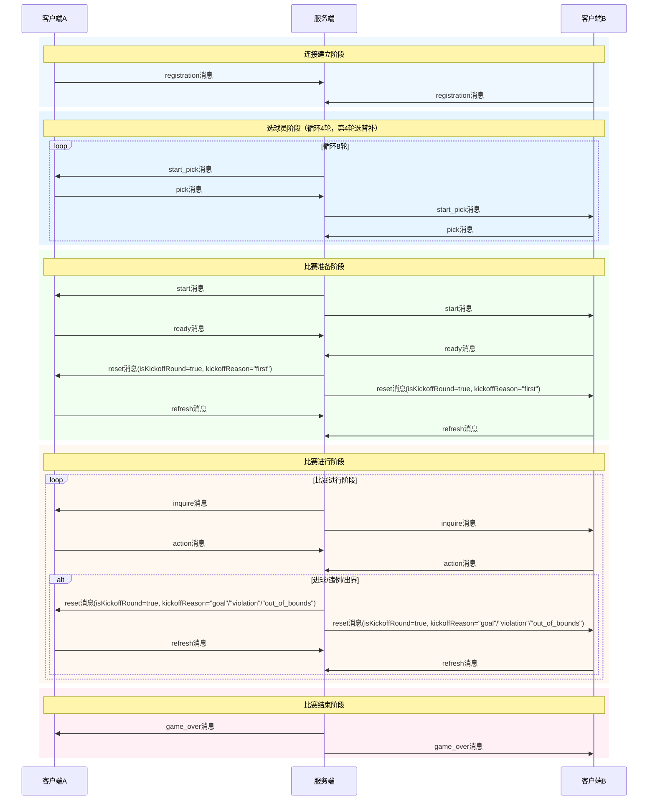
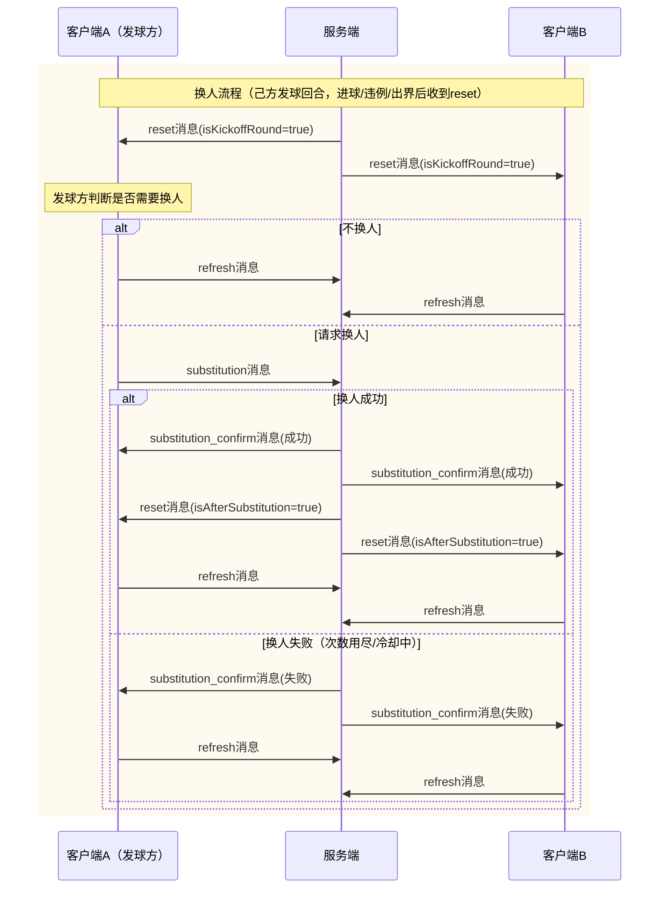

# 灌篮高手篮球比赛通讯协议

## 概述

采用C/S方式交互，对战过程包含1个服务端和两个客户端，服务端由主办方提供，客户端由参战队伍提供。

客户端与服务端之间，通过TCP Socket通讯。

客户端Socket通信一次收包可能收不全（需处理粘包、分包问题），参赛队伍请务必考虑此场景，避免因收包未收全直接处理消息而导致掉线。

消息内容均为文本格式，使用ASCII字符表示，编码为UTF-8编码。

## 消息格式

消息格式为：消息体长度+消息体。其中消息体长度固定为5个字符，不足5位前面补填0。消息长度采用字节长度，而非字符串长度。

消息体：JSON格式。

若无特殊说明，消息中所有字段均为必选。

## 游戏地图与坐标系

### 场地规格

- 球场由 **`N` 行 `M` 列** 个方格组成（`N`、`M` 均为整数，具体数值见赛事公告）。
- **坐标系**：以球场 **左下角为原点 `(0, 0)`**，x轴向右递增（列索引），y轴向上递增（行索引）。
- 场地被 **中场线** 分割为红方半场和蓝方半场。
- 初赛球场尺寸是28列(x) × 29行(y)，左下角为原点 `(0, 0)`

### 关键区域坐标与定义 (初赛 28列 x 29行 场地)

- **篮筐**: 位于红方底线中央，坐标 `(0, 14)` (第一列的中间行)。
- **三分线**: 以篮筐为中心，同列格子曼哈顿距离 ≥ 12，其他列格子曼哈顿距离 ≥ 13。
- **中距离**：以篮筐为中心，满足 4 < 曼哈顿距离 < 13 的所有格子
- **禁区**：以篮筐为中心，曼哈顿距离 ≤ 4 的所有格子构成的区域

### 单位位置判定

- 每个格子同一时间最多容纳一名球员（球员与篮球可同占一格）。
- 若篮筐或目标位置已被占据，球员无法移动至该位置（篮板位置允许被占据）。

## 消息交互流程

### 连接建立阶段

1. **客户端连接服务端**
2. **客户端发送注册消息**
3. **服务端回复选球员消息**
4. **客户端发送确认选球员消息**

### 比赛准备阶段

1. **服务端发送游戏开始消息**
2. **客户端回复准备完成消息**
3. **服务端发送开球消息**
4. **客户端回复开球响应消息**

### 开球回合流程

开球回合（isKickoffRound=true）的处理流程如下：

```
1. 服务端 -> 客户端A,B: reset (isKickoffRound=true, isAfterSubstitution=false)
   └── 包含双方首发球员信息和替补球员信息

2. 己方发球回合客户端 -> 服务端: substitution 或 refresh（二选一，互斥）
   └── 如果发送substitution，等待新的reset，不再发送refresh

3. 非己方发球回合客户端 -> 服务端: refresh

4. 服务端处理换人请求：
   └── 如果己方发球回合方发送substitution且合法：应用换人，发送reset (isAfterSubstitution=true)
   └── 如果发送refresh：进入步骤5

5. 双方客户端 -> 服务端: refresh (开球站位)

6. 服务端 -> 客户端A,B: inquire (询问行动指令)
```

**注意事项**：
- 己方发球回合才能发起换人请求
- substitution消息仅在refresh状态（收到reset后）可以处理
- substitution成功后，服务端会下发新的reset，客户端收到isAfterSubstitution=true的reset后不再发送换人请求
- substitution_confirm消息会广播给双方所有客户端，通过playerId字段区分是谁的换人请求

### 比赛进行阶段

每回合循环：

1. **服务端发送询问消息**
2. **客户端发送行动消息**
3. **服务端回合结算并发送新的开球消息或询问消息**

### 比赛结束阶段

1. **服务端发送游戏结束消息**

### 时序图



### 换人时序图



**换人时序说明**：

1. 换人仅发生在己方发球回合（进球/违例/出界后，服务端下发reset消息时）
2. 发球方收到reset后，可选择发送substitution请求换人，或直接发送refresh跳过换人
3. 非发球方始终发送refresh，不参与换人决策
4. 换人成功时，服务端广播substitution_confirm（成功），随后下发新的reset（isAfterSubstitution=true），双方需再回复refresh
5. 换人失败时（次数用尽或冷却中），服务端广播substitution_confirm（失败），发球方需继续发送refresh
6. 每队全场共有2次换人机会，每次换人后需间隔5个回合才能再次换人

**时序说明**：

1. **连接与注册**：两个客户端分别连接服务端并发送registration消息
2. **选球员**：服务端按轮次向双方发送start_pick，客户端回复pick，双方所选球员不能冲突，可选相同类型球员。如冲突系统随机从候选池指定球员。选人阶段共8轮，双方交替选人，红方先选（第7、8轮选替补）
3. **比赛开始**：服务端广播start消息，双方回复ready
4. **开球回合**：服务端广播reset（isKickoffRound=true），双方回复refresh（换人流程见上方换人时序图）
5. **比赛循环**：服务端发送inquire → 双方回复action → 服务端结算 → 若进球/违例/出界则发送reset重新开球，否则继续inquire
6. **比赛结束**：服务端广播game_over消息

## 消息详细说明

### 1. 注册消息 (client -> server)

**说明**：registration消息用于客户端向服务端注册自己的队伍Id和队名（客户端应在连接服务端成功后发此消息）。

```json
{
  "messageType": "registration",
  "playerID": "4位数字队伍ID",
  "teamName": "队伍名称"
}
```

**字段含义**：

- messageType：消息类型，固定值"registration"
- playerID：4位数字队伍ID，由主办方分配
- teamName：队伍名称，用于增强代入感

### 2. 球员选择

#### 2.1	选球星消息（server->client）

**说明**：start_pick消息用于服务端向客户端发送我方可以选择的球员列表。初赛为半场，三个球员，一个替补。选球员消息需要循环四次。初赛pick的轮次，范围为1-8。1、3、5、7为红色方选，其余为蓝色方。第7和第8回合选择的是替补。

```json
{
  "messageType": "start_pick",
  "pickRound": 1,
  "curBpInfo": [{
    "playerId": 1111,
    "pickStarIds": [2, 6]
  }, {
    "playerId": 2222,
    "pickStarIds": [3, 5]
  }],
  "availablePlayers": [
    {
      "playerType": "球员类型",
      "starID": "球员唯一标识",
      "name": "球员名称",
      "attributes": {
        "stamina": 600,
        "speed": 3,
        "shootingDistance": 8,
        "passingDistance": 8,
        "powerBonus": 0.15,
        "shootingBonus": 0.50,
        "passingBonus": 0.98,
        "defenseBonus": 0.50,
        "reboundBonus": 0.50,
        "dribblingBonus": 0.80
      },
      "skill": {
        "name": "专属技能名称",
        "staminaCost": 3,
        "bonus": 0.50,
        "duration": 1,
        "bonusType": "加成类型"
      }
    }
  ]
}
```

**字段含义**：

- messageType：消息类型，固定值"start_pick"
- pickRound: 当前的选球员回合，当前pick的轮次，范围为1-8。1、3、5、7为红色方选，其余为蓝色方。第7和第8回合选择的是替补。
- curBpInfo：双方已选球员信息
  - playerId：玩家ID
  - pickStarIds：已选的球员ID列表
- availablePlayers：可选球员数组
  - playerType：球员类型（控球后卫、三分射手、闪电后卫、防守专家）
  - starID：球员唯一标识
  - name：球员名称
  - attributes：球员属性
    - stamina：体力值（0-600）
    - speed：基础速度（2-3）
    - shootingDistance：投篮距离（5-13）
    - passingDistance：传球距离（4-8）
    - powerBonus：力量加成（百分比，如0.15表示15%）
    - shootingBonus：投球加成（百分比，如0.50表示50%）
    - passingBonus：传球加成（百分比，如0.98表示98%）
    - defenseBonus：防守加成（百分比，如0.50表示50%）
    - reboundBonus：篮板加成（百分比，如0.50表示50%）
    - dribblingBonus：运球加成（百分比，如0.80表示80%）
  - skill：专属技能
    - name：技能名称
    - staminaCost：体力消耗
    - bonus：技能加成（百分比）
    - duration：持续回合数
    - bonusType: 技能加成类型，表示加成的是传球/防守/篮板/运球/力量等

**球员类型说明**：

- 控球后卫：体力600，速度3，投篮距离7，传球距离8，力量加成15%，投球加成50%，传球加成98%，防守加成50%，篮板加成50%，运球加成80%，技能"精准传球"（消耗5+传球50%+1）
- 三分射手：体力600，速度2，投篮距离11，传球距离6，力量加成15%，投球加成80%，传球加成70%，防守加成50%，篮板加成30%，运球加成60%，技能"致命三分"（消耗6+投球50%+1）
- 闪电后卫：体力600，速度3，投篮距离9，传球距离5，力量加成20%，投球加成45%，传球加成60%，防守加成25%，篮板加成50%，运球加成60%，技能"闪电突破"（消耗6+突破50%+1）
- 防守专家：体力600，速度2，投篮距离5，传球距离4，力量加成50%，投球加成40%，传球加成60%，防守加成98%，篮板加成90%，运球加成40%，技能"死亡缠绕"（消耗5+防守80%+1）

#### 2.2 确认选球员消息 (client -> server)

**说明**：pick消息用于客户端向服务端发送我方选择的球员。每次选择一名球员。

```json
{
  "messageType": "pick",
  "pickRound": 1,
  "selectedPlayer": {
    "starID": "球员唯一标识"
  }
}
```

**字段含义**：

- messageType：消息类型，固定值"pick"
- pickRound：当前选球员回合
- selectedPlayer：选中的球员对象
  - starID：球员唯一标识

### 3. 游戏开始消息 (server -> client)

**说明**：start消息用于服务端通知所有客户端游戏开始。

```json
{
  "messageType": "start",
  "gameID": "比赛唯一标识",
  "camp": "0",
  "mapInfo": {
    "width": 28,
    "height": 29,
    "hoopPosition": [0, 14],
    "backboardPositions": [[0, 13], [0, 15]],
    "threePointDistance": 12,
    "midRangeDistance": 13,
    "restrictedAreaDistance": 4
  },
  "redCampInfo": [
    {
      "starID": "球员唯一标识",
      "name": "球员名称",
      "playerType": "球员类型",
      "position": [5, 10],
      "stamina": 600,
      "starInfo": {
        "stamina": 600,
        "speed": 3,
        "shootingDistance": 8,
        "passingDistance": 8,
        "powerBonus": 0.15,
        "shootingBonus": 0.50,
        "passingBonus": 0.98,
        "defenseBonus": 0.50,
        "reboundBonus": 0.50,
        "dribblingBonus": 0.80
      }
    }
  ],
  "blueCampInfo": [
    // 蓝色方信息，格式同上
  ],
  "scores": {
    "redCamp": 0,
    "blueCamp": 0
  }
}
```

**字段含义**：

- messageType：消息类型，固定值"start"
- gameID：比赛唯一标识
- camp：阵营标识（0:红方, 1:蓝方）
- mapInfo：地图信息
  - width：地图宽度（列数）
  - height：地图高度（行数）
  - hoopPosition：篮筐位置 [x, y]
  - backboardPositions：篮板位置数组 [[x1, y1], [x2, y2]]
  - threePointDistance：三分线距离（曼哈顿距离）
  - midRangeDistance：中距离上界（曼哈顿距离）
  - restrictedAreaDistance：禁区距离（曼哈顿距离）
- redCampInfo：红方球员信息数组
- blueCampInfo：蓝方球员信息数组
  - starID：球员唯一标识
  - name：球员名称
  - playerType：球员类型
  - position：初始位置 [x, y]
  - stamina：当前体力值
  - starInfo：球员属性（含stamina/speed/shootingDistance/passingDistance/powerBonus/shootingBonus/passingBonus/defenseBonus/reboundBonus/dribblingBonus）
- scores：比分信息
  - redCamp：红方得分
  - blueCamp：蓝方得分

### 4. 准备完成消息 (client -> server)

**说明**：ready用于客户端在收到start消息处理完成后，回复准备完成消息给服务端。

```json
{
  "messageType": "ready",
  "playerId": 1111
}
```

### 5. 开球消息 (server -> client)

**说明**：reset消息用于服务端通知所有客户端开始新的一局/进球后重新开球。

```json
{
  "messageType": "reset",
  "isKickoffRound": true,
  "isAfterSubstitution": false,
  "kickoffPlayerId": 2222,
  "kickoffReason": "goal",
  "scores": {
    "redCampScore": 0,
    "blueCampScore": 0
  },
  "ballInfo": {
    "position": [0, 14],
    "state": "FREE",
    "owner": null,
    "target": null
  },
  "redCampInfo": [{
    "starID": "球员唯一标识",
    "name": "球员名称",
    "position": [5, 10],
    "stamina": 600,
    "starInfo": {
      "stamina": 600,
      "speed": 3,
      "shootingDistance": 8,
      "passingDistance": 8,
      "powerBonus": 0.15,
      "shootingBonus": 0.50,
      "passingBonus": 0.98,
      "defenseBonus": 0.50,
      "reboundBonus": 0.50,
      "dribblingBonus": 0.80
    },
    "state": "NORMAL",
    "actions": []
  }],
  "blueCampInfo": [
    // 蓝色方信息，格式同上
  ],
  "redBenchInfo": [
    {
      "starID": "球员唯一标识",
      "name": "球员名称",
      "stamina": 600
    }
  ],
  "blueBenchInfo": [
    // 蓝色方替补球员信息，格式同上
  ]
}
```

**字段含义**：

- messageType：消息类型，固定值"reset"
- isKickoffRound：是否为开球回合
- isAfterSubstitution：是否为换人后的重置回合（用于客户端判断是否需要发送换人请求）
- kickoffPlayerId：开球方玩家ID（仅在isKickoffRound=true时有值，否则为null）
- kickoffReason：开球原因（仅在isKickoffRound=true时有值，否则为null），取值如下：
  - "first"：开局首次开球
  - "goal"：进球后重新开球
  - "out_of_bounds"：界外球
  - "violation"：违例
- scores：当前比分
- ballInfo：篮球信息
  - position：篮球位置 [x, y]
  - state：篮球状态（HELD:被持球, AIR:空中飞行, FREE:自由状态, REBOUND:篮板争抢中）
  - owner：持球球员starID（如果持球）
  - target：篮球目标位置（投篮/传球时）
- redCampInfo/blueCampInfo：双方场上球员信息
  - starID：球员唯一标识
  - name：球员名称
  - position：球员位置 [x, y]
  - stamina：当前体力
  - starInfo：球员属性
  - state：球员状态
  - actions：上一回合动作结算列表（每个action含originalPos/type/execRes，可选targetPos）
- redBenchInfo/blueBenchInfo：双方替补球员信息
  - starID：球员唯一标识
  - name：球员名称
  - stamina：当前体力

**开球位置说明**：
- 开球时，球的位置根据开球方阵营决定：红方 `(0, 14)`，蓝方 `(28, 14)`
- 开球球员位置必须与球的位置一致，否则服务端会强制修正

### 6. 开球响应消息 (client -> server)

**说明**：refresh用于客户端在收到服务端reset消息后，回复刷新各球星初始位置给服务端。

```json
{
  "messageType": "refresh",
  "playerId": 1111,
  "stars": [
    {
      "starId": "球员唯一标识",
      "starPos": [5, 10]
    }
  ],
  "kickoffStarId": 1
}
```

**字段含义**：

- messageType：消息类型，固定值"refresh"
- playerId：队伍ID
- stars：球员位置数组（初赛球员个数为3，客户端需要给出三个球员位置）
  - starId：球员唯一标识
  - starPos：球员位置 [x, y]
- kickoffStarId：必须指定开球球员ID（仅在开球回合必填）
- 开球球员位置必须与球的位置一致（红方(0,14)或蓝方(28,14)），否则服务端会强制修正

### 7. 询问消息 (server -> client)

**说明**：inquire消息用于服务端向玩家询问行动指令，同时携带上一回合动作结算结果。

```json
{
  "messageType": "inquire",
  "round": 1,
  "isKickoffRound": false,
  "isOvertime": false,
  "remainingTime": 500,
  "ballInfo": {
    "position": [5, 10],
    "state": "HELD",
    "owner": "球员starID",
    "target": null
  },
  "playerInfo": [{
    "playerId": 1111,
    "score": 0,
    "stars": [{
      "starID": "球员唯一标识",
      "name": "球员名称",
      "position": [5, 15],
      "stamina": 600,
      "isBenchPlayer": 0,
      "skill": {
        "name": "专属技能名称",
        "staminaCost": 3,
        "bonus": 0.50,
        "duration": 1,
        "cooldown": 0
      },
      "state": "NORMAL",
      "actions": [{
        "originalPos": [5, 17],
        "type": "MOVE",
        "targetPos": [5, 15],
        "execRes": "success"
      }]
    }]
  }]
}
```

**字段含义**：

- messageType：消息类型，固定值"inquire"
- round：当前回合数
- isKickoffRound：是否为开球回合
- isOvertime：是否为加时赛
- remainingTime：剩余思考时间(ms)
- ballInfo：篮球信息
- playerInfo：队伍信息，由两个队伍字典构成的列表
  - playerId：队伍ID
  - score：得分
  - stars：每个队员的详细信息
    - starID：球员唯一标识
    - name：球员名称
    - position：球员当前位置 [x, y]
    - stamina：当前体力
    - isBenchPlayer：是否替补（0:否, 1:是）
    - skill：技能信息
      - name：技能名称
      - staminaCost：技能体力消耗
      - bonus：技能加成
      - duration：持续回合数
      - cooldown：剩余冷却回合数
    - state：球员状态（NORMAL:正常, DRIBBLE:运球中）
    - actions：上一回合动作结算列表
      - originalPos：动作执行时球员位置 [x, y]
      - type：动作类型（MOVE/SHOOT/PASS/SKILL/STEAL/DEFEND/REBOUND/WAIT）
      - execRes：执行结果（success/fail/invalid）
      - targetPos：目标位置 [x, y]（MOVE/SHOOT/PASS时有此字段）

### 8. 行动消息 (client -> server)

**说明**：actions消息用于玩家向服务端发出行动指令组合。move指令可与pass、shoot、skill、defend、rebound、steal组合使用。

```json
{
  "messageType": "action",
  "playerId": "玩家ID",
  "round": "当前回合数",
  "stars": [
    {
      "starId": "球员唯一标识",
      "actions": [
        {"type": "move", "targetPos": [22, 16]},
        {"type": "shoot", "hoopId": 0}
      ]
    },
    {
      "starId": "球员唯一标识",
      "actions": [
        {"type": "pass", "targetStarId": 5, "targetPos": [12, 14]}
      ]
    },
    {
      "starId": "球员唯一标识",
      "actions": [
        {"type": "steal", "targetStarId": 3}
      ]
    }
  ]
}
```

**字段含义**：

- messageType：消息类型，固定值"action"
- playerId：玩家ID
- stars：球员行动数组
  - starId：球员唯一标识
  - actions：行动信息数组
    - type：行动类型
    - targetPos：目标位置 [x, y]（移动/传球时）
    - targetStarId：目标球员ID（传球时为接球球员ID，抢断时为被抢断球员ID，防守时为防守目标球员ID）
    - hoopId：篮筐ID（投篮时，红框：0，蓝框：1）

### 9. 换人请求消息 (client -> server)

**说明**：substitution消息用于己方发球回合客户端在收到reset消息后请求换人。非己方发球回合不能发送换人请求。客户端在收到reset消息后，可以选择发送substitution消息或refresh消息，但两者互斥（发送substitution后不再发送refresh，等待新的reset）。

```json
{
  "messageType": "substitution",
  "playerId": "玩家ID",
  "playerOut": "下场球员starID",
  "playerIn": "上场球员starID",
  "position": [15, 5]
}
```

**字段含义**：

- messageType：消息类型，固定值"substitution"
- playerId：玩家ID（必须是己方发球回合方）
- playerOut：下场球员starID
- playerIn：上场球员starID
- position：上场位置 [x, y]

**限制**：
- 仅己方发球回合可以发起换人
- 持球球员不能被换下
- 每队全场共有2次换人机会
- 每次换人后需间隔5个回合才能再次换人

### 10. 换人确认消息 (server -> client)

**说明**：substitution_confirm消息用于服务端确认换人结果，**会广播给双方所有客户端**。

```json
{
  "messageType": "substitution_confirm",
  "playerId": "请求换人的玩家ID",
  "success": true,
  "playerOut": "下场球员starID",
  "playerIn": "上场球员starID",
  "failReason": ""
}
```

**字段含义**：

- messageType：消息类型，固定值"substitution_confirm"
- playerId：请求换人的玩家ID（用于区分是自己的换人请求还是对手的）
- success：是否成功
- playerOut：下场球员starID
- playerIn：上场球员starID
- failReason：失败原因（如果失败）

### 11. 游戏结束消息 (server -> client)

**说明**：game_over用于游戏结束时，服务端广播给所有客户端发送的消息。

```json
{
  "messageType": "game_over",
  "result": "win",
  "finalScore": {
    "redCampScore": 85,
    "blueCampScore": 78
  },
  "reason": "达到最大回合数",
  "statistics": {
    "totalRounds": 500,
    "redCampStats": {
      "totalShots": 45,
      "successfulShots": 28,
      "assists": 15,
      "rebounds": 35,
      "steals": 8,
      "turnovers": 12
    },
    "blueCampStats": {
      "totalShots": 42,
      "successfulShots": 26,
      "assists": 14,
      "rebounds": 32,
      "steals": 10,
      "turnovers": 15
    }
  }
}
```

**字段含义**：

- messageType：消息类型，固定值"game_over"
- result：比赛结果（win/lose/draw）
- finalScore：最终比分
  - redCampScore：红方得分
  - blueCampScore：蓝方得分
- reason：结束原因
- statistics：统计数据
  - totalRounds：总回合数
  - redCampStats：红方统计数据
    - totalShots：总投篮次数
    - successfulShots：命中次数
    - assists：助攻次数
    - rebounds：篮板次数
    - steals：抢断次数
    - turnovers：失误次数
  - blueCampStats：蓝方统计数据（格式同上）

## 行动类型定义

### 移动类行动

- **MOVE**: 移动到指定位置（扣除1点体力，失败不扣体力）
- **DRIBBLE**: 原地运球（扣除0点体力）

### 进攻类行动

- **SHOOT**: 投篮（扣除1点体力），需指定hoopId（篮筐ID，红框：0，蓝框：1）
- **PASS**: 传球（扣除1点体力），需指定targetStarId（接球球员ID），可选指定targetPos

### 防守类行动

- **STEAL**: 抢断（扣除1点体力），需指定targetStarId（被抢断球员ID）
- **DEFEND**: 贴身防守（扣除1点体力），需指定targetStarId（防守目标球员ID）
- **REBOUND**: 争抢篮板（扣除1点体力）

### 技能行动

- **SKILL**: 使用技能（扣除技能消耗体力），技能效果取决于技能类型和bonusType，可选指定targetStarId（目标球员ID）

### 特殊行动

- **WAIT**: 等待（无行动，扣除0点体力，恢复1点体力，持球球员和无球球员均可使用）

### 行动类型说明

- move指令可与pass、shoot、skill、defend、rebound、steal组合使用
- 其他组合视为无效（系统统计无效指令数）
- 未指定动作：若超时未提交指令，则该球员本回合默认执行wait动作（持球球员原地运球，无球球员原地待命）

## 数据结构规范

### 坐标系统

- 使用二维坐标 [x, y] 数组格式
- 原点 (0, 0) 为球场左下角
- y轴向上递增，x轴向右递增
- 曼哈顿距离计算: |x1-x2| + |y1-y2|

### 球员状态枚举

- **NORMAL**: 正常状态
- **DRIBBLE**: 运球状态（持球运球中）

### 篮球状态枚举

- **HELD**: 被持球
- **FREE**: 自由状态
- **REBOUND**: 篮板争抢中

## 体力影响规则

- 体力上限：600
- 体力 ≥ 420（≥70%）：能力值 100%
- 体力 240-419（40-69%）：能力值 80%
- 体力 120-239（20-39%）：能力值 60%
- 体力 0-119（<20%）：能力值 40%，进入疲劳状态
- 体力为0：该球员只能执行WAIT或DRIBBLE（0消耗动作），无法执行需要消耗体力的动作
- 每回合移动扣除1点体力，移动失败不扣体力
- 使用技能按技能消耗扣除体力，技能与其他动作组合时各动作独立扣除体力
- 执行WAIT动作成功时恢复1点体力

## 游戏规则

### 回合制结算顺序

**注：以下所有计算都要求四舍五入取整**

1. 回合开始：所有正在生效的技能效果持续时间减1
2. 指令提交：双方为所有上场的球员提交动作指令
3. 体力校验与扣除：系统在执行指令前进行体力预检，若体力不足，该指令将被忽略
   - 若指令包含技能，检查是否满足技能消耗体力，若不满足，忽略该指令
   - 检查是否满足移动消耗体力（基础1点），若不满足，忽略移动指令
   - 若为组合指令（如move+pass），检查组合总消耗，若不满足，只结算move，忽略其他指令
4. 移动判定：按球员速度值从高到低依次结算移动，速度相同时按剩余距离 > 剩余体力 > 力量加成 > 随机（本轮开球方优先）顺序结算
   - 若目标格已被先移动的球员占据，后移动球员将被系统安置在目标位置曼哈顿距离为1的相邻位置；若无法安置，则停留在原地
   - 球员每回合的最大移动距离 = MAX(1, ⌊基础速度 × (1 + 突破技能加成) × 体力发挥系数⌋)
5. 动作判定：按动作类型进行判定（抢断、传球、投篮、技能等）
6. 结束阶段：清理场地，扣除体力，回合数+1

### 投篮判定

- 有效防守判定：防守投篮球员为发出defend指令且与投篮球员曼哈顿距离≤2的对方球员
- 投篮能力 = 投篮距离 × (1 + 力量加成 + 投球加成 + 投球技能加成) × 体力发挥系数（四舍五入取整）
- 防守能力 = 防守球员基础速度 × (1 + 力量加成 + 防守加成 + 防守技能加成) × 体力发挥系数（四舍五入取整）
- 最大投篮距离 = ⌊投篮能力 - Σ(有效防守投篮能力)⌋（四舍五入取整）
- 防守干扰系数 = 有效防守人数 × 0.3
- 投篮命中率 = (最大投篮距离 / 射手与篮框距离) × 距离系数 × 1 / (1 + 防守干扰系数)（四舍五入取整）
- 距离系数：三分线外0.8，中距离0.9，禁区内0.95
- 投篮命中率 > 1时，命中成功
- 投篮命中率 == 1时，随机判定（随机数 > 1 命中，否则篮板球）
- 投篮命中率 < 1时，若有有效防守球员，抢断成功；否则形成篮板球

### 传球判定

- 有效防守判定：
  - 防守传球球员：发出defend指令且与传球队员曼哈顿距离≤2的对方球员
  - 防守接球球员：发出defend指令且与接球队员曼哈顿距离≤2的对方球员
- 传球能力 = 基础传球距离 × (1 + 力量加成 + 传球加成 + 传球技能加成) × 体力发挥系数（四舍五入取整）
- 防守能力 = 防守球员基础速度 × (1 + 力量加成 + 防守加成 + 防守技能加成) × 体力发挥系数（四舍五入取整）
- 最大传球距离 = MAX(1, ⌊传球能力 - Σ(有效防守能力)⌋)（四舍五入取整）
- 最大传球距离 >= 传接球曼哈顿距离：目标位置有人则传球成功，球到目标球员手上；否则判为界外球
- 最大传球距离 < 传接球曼哈顿距离：
  - 若有有效防守球员：传球失败，球被最近的有效防守球员抢走（距离相同则随机）
  - 若无有效防守球员：传球距离不足，球落在传球者到目标方向上距传球者曼哈顿距离为最大传球距离的坐标点，球变为自由状态，传球者变为普通状态（清除带球/运球状态）。若落点处有球员，该球员获得球权并进入带球状态
- 界外球发球：根据原目标位置决定发球点（左方半场 `(0, 14)`，右方半场 `(28, 14)`）

### 篮板争抢

- 投篮不中后，篮球随机落到篮筐附近曼哈顿距离≤3的格子内（不包含篮筐位置）
- 篮板成功率 = (基础速度 × (1 + 力量加成 + 篮板加成) × 体力发挥系数) / 球员与球位置的距离（四舍五入取整）
- 球员与球位置重叠则不用争抢，直接成功
- 篮板成功率大者胜，相同则由系统使用确定性随机判定

### 抢断判定

- 位置判定：持球球员与偷球球员移动结算后的曼哈顿距离≤2
- 抢断能力 = 基础速度 × (1 + 力量加成 + 突破技能加成) × 体力发挥系数（四舍五入取整）
- 护球能力 = 持球球员基础速度 × (1 + 力量加成 + 运球加成) × 体力发挥系数（四舍五入取整）
- 抢断能力 > 护球能力：抢断成功
- 抢断能力 ≤ 护球能力：抢断失败

### 攻防转换规则

- 防守方获得球权后（抢断/篮板/对方失误），必须先将球运出三分线方可进攻
- 持球球员需移动至三分线外任意位置，出线过程可被对方防守/抢断
- 传球给三分线外的队友也可清除进攻限制
- 出线过程中若被对方抢断，攻防未转换，对方可直接发起进攻
- 直接抢断后投篮：若抢断位置已在三分线外，可直接进攻
- 界外球发球：根据原目标位置决定发球点（左方半场 `(0, 14)`，右方半场 `(28, 14)`），发球位置自动设于三秒区外，不适用出线规则
- 进攻违例：球权转换后（防守方抢到球后/界外球）未出三分线直接投篮，判违例，对方获得球权在半场边线随机位置发球
- 传球距离不足：传球距离不足且无有效防守时，球落在传球者到目标方向上距传球者最大传球距离的坐标点，球变为自由状态，传球者变为普通状态。若落点处有球员，该球员获得球权并进入带球状态

### 换人规则

- 每队全场共有2次换人机会
- 换人时机：死球状态（进球后、出界后）且处于己方发球回合
- 己方发球回合即可发起换人请求
- 换人消息与refresh消息互斥：发送substitution后不再发送refresh
- 换人后流程：
  - 服务端发送换人确认消息（substitution_confirm）给双方
  - 如果换人成功，服务端下发新的reset（isAfterSubstitution=true）
  - 客户端收到isAfterSubstitution=true的reset后，不再发送换人请求，直接发送refresh
- 换人冷却：每次换人后需间隔5个回合才能再次换人
- 持球球员不能被换下
- 体力恢复：被换下的替补球员，在场下时每1个回合恢复2点体力

### 胜负规则

- 最大回合数：500回合
- 得分：三分线外投篮命中3分，中距离/禁区内投篮命中2分
- 平分时进入加时赛100回合，加时赛开始时双方各恢复100点体力至所有球员（上限600）
- 加时赛后仍平分，则以所有球员的剩余总体力高者获胜

### 场地规则

- 每个格子同一时间最多容纳一名球员（球员与篮球可同占一格）
- 若篮筐或目标位置已被占据，球员无法移动至该位置（篮板位置允许被占据）
- 指令组合：move指令可与pass、shoot、skill、defend、rebound、steal组合使用，其他组合视为无效（系统统计无效指令数）
- 未指定动作：若超时未提交指令，则该球员本回合默认执行wait动作（持球球员原地运球，无球球员原地待命）

## 超时规范

- 等待玩家注册消息超时时间默认为30s
- 等待玩家准备选择球员消息超时时间25s
- 等待玩家准备完成消息超时时间默认为1s
- 等待玩家动作响应消息超时时间默认为500ms
- 动作指令超时、消息缺少必选字段、消息格式错误无法解析累计5次，直接判负

## 注意事项

1. **消息长度**: 消息体长度固定5字符，不足补0
2. **编码格式**: 统一使用UTF-8编码
3. **字段必选**: 除非特别说明，所有字段均为必选
4. **错误处理**: 客户端需处理各种异常情况
5. **粘包分包**: 必须正确处理TCP粘包和分包问题
6. **超时处理**: 严格遵守各阶段超时限制
